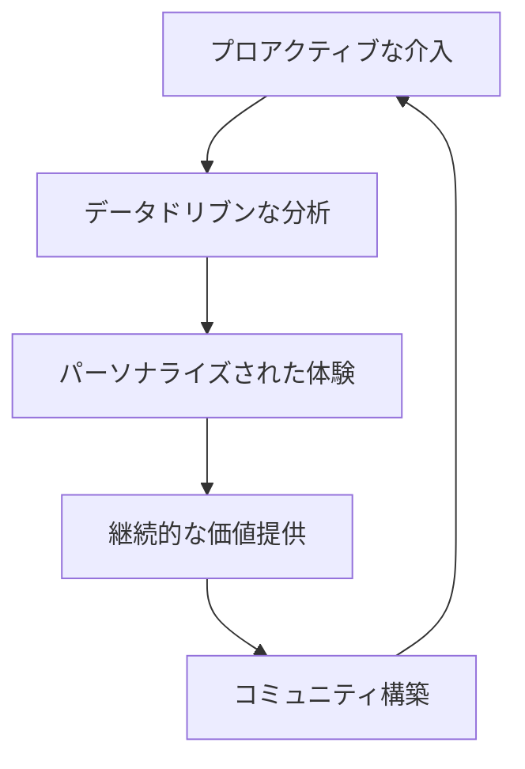

# SaaS Business Strategy 2024: 5 Critical Points for Success

The SaaS market continues to evolve rapidly, with 2024 marking a particularly important turning point. In an increasingly competitive landscape, what strategies will lead to success?

This article provides detailed explanations of five critical points for SaaS business success in 2024, based on the latest market trends and success stories.

## Current State of the SaaS Market and 2024 Outlook

### Rapid Market Expansion

The SaaS market continues its remarkable growth, with the following predictions for 2024:

- **Global Market Size**: Approximately $300 billion (15% increase from previous year)
- **Japanese Domestic Market**: Approximately 1.2 trillion yen (20% increase from previous year)
- **Enterprise SaaS Adoption Rate**: Over 85%

### Key Trends

1. **Establishment of Hybrid Work**
2. **Full-scale Adoption of AI and Machine Learning**
3. **Growing Interest in Data Security**
4. **Shift from Siloed Solutions to Platform Integration**
5. **Increased Awareness of Sustainability**

## Critical Point 1: Evolution of Customer Success

### Moving Beyond Traditional Approaches

Customer success in 2024 becomes a strategic initiative that goes beyond mere customer support.

#### Elements of New Customer Success



### Specific Measures to Implement

#### 1. Advanced Health Scoring

```typescript
interface CustomerHealthScore {
  usage: number // Usage rate
  engagement: number // Engagement rate
  support: number // Support usage frequency
  business: number // Business outcome metrics
  sentiment: number // Sentiment analysis score
}

function calculateHealthScore(metrics: CustomerHealthScore): number {
  const weights = {
    usage: 0.25,
    engagement: 0.20,
    support: 0.15,
    business: 0.30,
    sentiment: 0.10
  }
  
  return Object.entries(metrics).reduce((total, [key, value]) => {
    return total + (value * weights[key as keyof typeof weights])
  }, 0)
}
```

#### 2. Predictive Churn Prevention

- **Machine Learning Models** for churn prediction
- **Automated Alert** system implementation
- **Personalized Intervention** strategies

### Success Story: Slack

Slack achieved customer success through the following initiatives:

- **Onboarding Optimization**: Improved 7-day active user rate for new users to 85%
- **Usage Analysis**: Analyzed team usage patterns and provided utilization recommendations
- **Community Building**: Provided platform for user-to-user information exchange

## Critical Point 2: Product-Led Growth (PLG) Strategy

### What is PLG?

Product-Led Growth (PLG) is a growth strategy where the product itself becomes the primary driver for user acquisition, retention, and expansion.

### Four Steps to PLG Implementation

#### Step 1: Freemium Model Design

```yaml
# Freemium Plan Design Example
free_plan:
  users: 5
  storage: "1GB"
  features:
    - "Basic Features"
    - "Email Support"
  limitations:
    - "No Advanced Features"
    - "API Restrictions"

paid_plan:
  users: "Unlimited"
  storage: "100GB"
  features:
    - "All Features Available"
    - "Priority Support"
    - "Unlimited API"
```

#### Step 2: Onboarding Optimization

- **Time to Value (TTV)** reduction
- **Interactive Tutorials**
- **Progress Indicators** for achievement motivation

#### Step 3: User Behavior Analysis and Improvement

```javascript
// User behavior tracking example
const trackUserBehavior = {
  onboarding: {
    signup: Date,
    firstLogin: Date,
    profileComplete: Date,
    firstAction: Date,
    firstValue: Date
  },
  
  engagement: {
    dailyActiveUsers: number,
    featureUsage: object,
    sessionDuration: number
  },
  
  conversion: {
    trialStart: Date,
    upgradePrompts: number,
    conversionEvent: Date
  }
}
```

#### Step 4: Viral Feature Implementation

- **Invitation System**
- **Sharing Features**
- **Collaboration Tools**

### PLG Success Story: Figma

Figma's success factors:

1. **Comprehensive Free Plan**: Sufficient features for individual use
2. **Real-time Collaboration**: Natural invitation and sharing mechanisms
3. **Intuitive UI**: Reduced learning curve
4. **Template Library**: Immediate value realization

## Critical Point 3: Strategic AI and Machine Learning Utilization

### Areas of AI Application in SaaS

#### 1. Customer Experience Enhancement

- **Chatbots** for 24/7 support
- **Personalization** engines
- **Predictive Analytics** for recommendation features

#### 2. Operational Efficiency

- **Automated Workflows**
- **Anomaly Detection Systems**
- **Data Analysis Automation**

#### 3. Product Development

- **A/B Testing** auto-optimization
- **User Behavior Prediction**
- **Feature Usage Pattern Analysis**

### Practical AI Implementation Examples

```python
# Customer Support AI Example
import openai
from typing import Dict, List

class CustomerSupportAI:
    def __init__(self, api_key: str):
        self.client = openai.Client(api_key=api_key)
        
    def generate_response(self, query: str, context: Dict) -> str:
        prompt = f"""
        Customer inquiry: {query}
        Customer information: {context}
        
        Please generate an appropriate and helpful response.
        """
        
        response = self.client.chat.completions.create(
            model="gpt-4",
            messages=[{"role": "user", "content": prompt}]
        )
        
        return response.choices[0].message.content
    
    def analyze_sentiment(self, text: str) -> float:
        # Sentiment analysis logic
        pass
```

### Considerations for AI Implementation

<Callout type="warning">
When implementing AI, pay attention to the following:
- **Data Privacy** protection
- **Bias** elimination
- **Transparency** assurance
- **Human Override** functionality implementation
</Callout>

## Critical Point 4: Data-Driven Management Implementation

### Key Performance Indicators (KPI) Setting

#### ARR (Annual Recurring Revenue) Related

```typescript
interface ARRMetrics {
  newARR: number        // New ARR
  expansionARR: number  // Expansion ARR
  contractionARR: number // Contraction ARR
  churnARR: number      // Churn ARR
  netARR: number        // Net ARR
}

const calculateNetARRGrowth = (metrics: ARRMetrics): number => {
  return (metrics.newARR + metrics.expansionARR - 
          metrics.contractionARR - metrics.churnARR) / 
          metrics.newARR * 100
}
```

#### Unit Economics

- **CAC (Customer Acquisition Cost)**: Customer acquisition cost
- **LTV (Lifetime Value)**: Customer lifetime value
- **LTV/CAC Ratio**: 3:1 or higher is ideal
- **CAC Payback Period**: Target of 12 months or less

### Dashboard Construction

```yaml
# Dashboard Configuration Example
executive_dashboard:
  - ARR Growth Rate
  - Churn Rate
  - NPS (Net Promoter Score)
  - CAC/LTV Ratio

product_dashboard:
  - DAU/MAU
  - Feature Usage Rates
  - Onboarding Completion Rate
  - Support Ticket Count

sales_dashboard:
  - Pipeline Status
  - Conversion Rate
  - Average Deal Size
  - Sales Cycle
```

### Data Utilization Success Story: HubSpot

HubSpot's data-driven strategy:

1. **Integrated Dashboard**: Company-wide KPI visualization
2. **Predictive Analytics**: Revenue forecasting and resource allocation optimization
3. **Segment Analysis**: Customer segment-specific strategy development
4. **Real-time Monitoring**: Immediate detection and response to anomalies

## Critical Point 5: Security and Compliance

### Essential Security Measures

#### 1. Zero Trust Architecture

```yaml
zero_trust_principles:
  - identity_verification: "Authentication and authorization for all users"
  - least_privilege: "Principle of least privilege"
  - network_segmentation: "Network isolation"
  - continuous_monitoring: "Continuous monitoring"
```

#### 2. Data Encryption

- **Encryption at Rest** (AES-256)
- **Encryption in Transit** (TLS 1.3)
- **Key Management** (HSM usage)

#### 3. Security Auditing

```typescript
interface SecurityAudit {
  penetrationTest: {
    frequency: "quarterly",
    scope: ["web", "api", "infrastructure"],
    reportDeadline: "2weeks"
  },
  
  vulnerabilityAssessment: {
    frequency: "monthly",
    tools: ["OWASP ZAP", "Nessus"],
    autoRemediation: boolean
  },
  
  complianceCheck: {
    standards: ["SOC2", "ISO27001", "GDPR"],
    auditFrequency: "annual",
    documentationRequired: boolean
  }
}
```

### Compliance Response

#### Key Regulations and Standards

1. **GDPR** (General Data Protection Regulation)
2. **SOC 2** (Security Controls)
3. **ISO 27001** (Information Security Management)
4. **CCPA** (California Consumer Privacy Act)

#### Features to Implement

- **Data Portability**
- **Right to be Forgotten**
- **Consent Management**
- **Data Processing Records**

## Implementation Roadmap

### Phase 1 (1-3 months): Foundation Building

- [ ] KPI setup and dashboard construction
- [ ] Customer success team launch
- [ ] Security infrastructure strengthening
- [ ] Data collection and analysis infrastructure building

### Phase 2 (4-6 months): PLG Feature Implementation

- [ ] Freemium plan design
- [ ] Onboarding optimization
- [ ] User behavior analysis implementation
- [ ] Viral feature addition

### Phase 3 (7-12 months): AI and Automation

- [ ] Phased AI feature implementation
- [ ] Predictive analytics system construction
- [ ] Automated workflow expansion
- [ ] Advanced personalization

## Summary

For SaaS business success in 2024, the following five points are crucial:

1. **Evolved Customer Success**: Data-driven and predictive approach
2. **PLG Strategy**: Product-led growth model
3. **AI Utilization**: Enhanced customer experience and operational efficiency
4. **Data-Driven Management**: Proper KPI setting and continuous improvement
5. **Security and Compliance**: Ensuring trustworthiness

By implementing these elements in an integrated manner, you can build a competitive SaaS business. The key is phased implementation and continuous improvement.

<Callout type="success">
The key to success is strategic design centered on customer value creation and establishing a continuous improvement cycle based on data.
</Callout>

## Next Steps

1. **Current State Analysis**: Understand your SaaS business's current position
2. **Prioritization**: Start with the areas of highest impact
3. **Execution Planning**: Set concrete roadmaps and milestones
4. **Team Building**: Secure talent with necessary skill sets
5. **Continuous Improvement**: Regular reviews and strategy adjustments

2024 presents a significant growth opportunity for SaaS businesses. With proper strategy and execution, let's achieve sustainable growth.