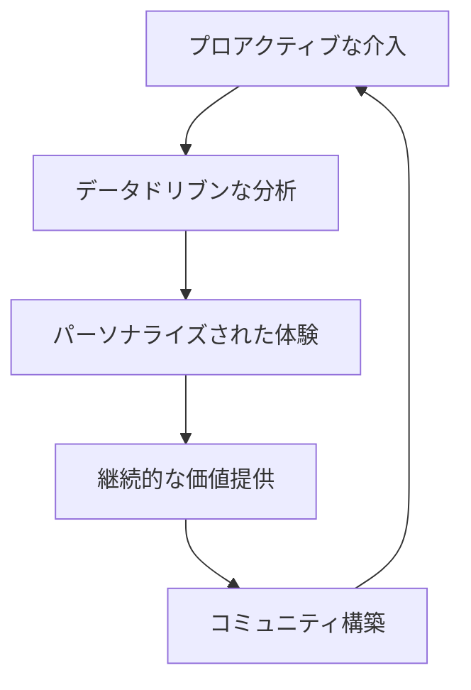

# 2024年のSaaSビジネス戦略：成功するための5つの重要ポイント

SaaS市場は急速に進化し続けており、2024年は特に重要な転換点となる年です。競争が激化する中で、どのような戦略を取れば成功できるのでしょうか？

本記事では、最新の市場動向と成功事例を基に、2024年にSaaSビジネスで成功するための5つの重要ポイントを詳しく解説します。

## SaaS市場の現状と2024年の展望

### 市場規模の急拡大

SaaS市場は驚異的な成長を続けており、2024年には以下の予測が立てられています：

- **グローバル市場規模**: 約$3,000億ドル（前年比15%増）
- **日本国内市場**: 約1.2兆円（前年比20%増）
- **企業のSaaS導入率**: 85%以上

### 主要トレンド

1. **ハイブリッドワークの定着**
2. **AI・機械学習の本格活用**
3. **データセキュリティへの関心高まり**
4. **縦割りソリューションからプラットフォーム化**
5. **サステナビリティへの意識向上**

## 重要ポイント1: カスタマーサクセスの進化

### 従来のアプローチからの脱却

2024年のカスタマーサクセスは、単なる顧客サポートを超えた戦略的な取り組みとなります。

#### 新しいカスタマーサクセスの要素



### 実装すべき具体的施策

#### 1. ヘルススコアの高度化

```typescript
interface CustomerHealthScore {
  usage: number // 利用率
  engagement: number // エンゲージメント率
  support: number // サポート利用頻度
  business: number // ビジネス成果指標
  sentiment: number // 感情分析スコア
}

function calculateHealthScore(metrics: CustomerHealthScore): number {
  const weights = {
    usage: 0.25,
    engagement: 0.20,
    support: 0.15,
    business: 0.30,
    sentiment: 0.10
  }
  
  return Object.entries(metrics).reduce((total, [key, value]) => {
    return total + (value * weights[key as keyof typeof weights])
  }, 0)
}
```

#### 2. 予測的チャーン防止

- **機械学習モデル**による離脱予測
- **自動アラート**システムの構築
- **パーソナライズされた介入**戦略

### 成功事例: Slack

Slackは以下の取り組みでカスタマーサクセスを実現：

- **オンボーディング最適化**: 新規ユーザーの7日以内アクティブ率を85%に向上
- **使用状況分析**: チーム内での利用パターンを分析し、活用提案を実施
- **コミュニティ構築**: ユーザー同士の情報交換プラットフォーム提供

## 重要ポイント2: プロダクトレッドグロース（PLG）戦略

### PLGとは何か？

プロダクトレッドグロース（PLG）は、プロダクト自体がユーザー獲得・維持・拡張の主要な推進力となる成長戦略です。

### PLG実装の4つのステップ

#### ステップ1: フリーミアムモデルの設計

```yaml
# フリーミアムプラン設計例
free_plan:
  users: 5
  storage: "1GB"
  features:
    - "基本機能"
    - "メールサポート"
  limitations:
    - "アドバンス機能なし"
    - "API制限あり"

paid_plan:
  users: "無制限"
  storage: "100GB"
  features:
    - "全機能利用可能"
    - "優先サポート"
    - "API無制限"
```

#### ステップ2: オンボーディング最適化

- **Time to Value（TTV）**の短縮
- **インタラクティブなチュートリアル**
- **プログレス表示**による達成感の演出

#### ステップ3: ユーザー行動の分析と改善

```javascript
// ユーザー行動追跡の例
const trackUserBehavior = {
  onboarding: {
    signup: Date,
    firstLogin: Date,
    profileComplete: Date,
    firstAction: Date,
    firstValue: Date
  },
  
  engagement: {
    dailyActiveUsers: number,
    featureUsage: object,
    sessionDuration: number
  },
  
  conversion: {
    trialStart: Date,
    upgradePrompts: number,
    conversionEvent: Date
  }
}
```

#### ステップ4: バイラル機能の実装

- **招待システム**
- **共有機能**
- **協業ツール**

### PLG成功事例: Figma

Figmaの成功要因：

1. **無料プランの充実**: 個人利用で十分な機能提供
2. **リアルタイム協業**: 自然な招待・共有の仕組み
3. **直感的なUI**: 学習コストの低減
4. **テンプレート提供**: すぐに価値を実感できる仕組み

## 重要ポイント3: AI・機械学習の戦略的活用

### SaaSにおけるAI活用の領域

#### 1. 顧客体験の向上

- **チャットボット**による24/7サポート
- **パーソナライゼーション**エンジン
- **予測分析**による提案機能

#### 2. 業務効率化

- **自動化ワークフロー**
- **異常検知システム**
- **データ分析の自動化**

#### 3. プロダクト開発

- **A/Bテスト**の自動最適化
- **ユーザー行動予測**
- **機能利用パターン分析**

### AI実装の実践例

```python
# カスタマーサポートAIの例
import openai
from typing import Dict, List

class CustomerSupportAI:
    def __init__(self, api_key: str):
        self.client = openai.Client(api_key=api_key)
        
    def generate_response(self, query: str, context: Dict) -> str:
        prompt = f"""
        顧客からの問い合わせ: {query}
        顧客情報: {context}
        
        適切で親切な回答を生成してください。
        """
        
        response = self.client.chat.completions.create(
            model="gpt-4",
            messages=[{"role": "user", "content": prompt}]
        )
        
        return response.choices[0].message.content
    
    def analyze_sentiment(self, text: str) -> float:
        # 感情分析ロジック
        pass
```

### AI活用の注意点

<Callout type="warning">
AI導入時は以下の点に注意が必要です：
- **データプライバシー**の保護
- **バイアス**の除去
- **透明性**の確保
- **人間によるオーバーライド**機能の実装
</Callout>

## 重要ポイント4: データドリブン経営の実践

### 重要指標（KPI）の設定

#### ARR（Annual Recurring Revenue）関連

```typescript
interface ARRMetrics {
  newARR: number        // 新規ARR
  expansionARR: number  // 拡張ARR
  contractionARR: number // 縮小ARR
  churnARR: number      // 解約ARR
  netARR: number        // ネットARR
}

const calculateNetARRGrowth = (metrics: ARRMetrics): number => {
  return (metrics.newARR + metrics.expansionARR - 
          metrics.contractionARR - metrics.churnARR) / 
          metrics.newARR * 100
}
```

#### ユニットエコノミクス

- **CAC（Customer Acquisition Cost）**: 顧客獲得コスト
- **LTV（Lifetime Value）**: 顧客生涯価値
- **LTV/CAC比率**: 3:1以上が理想
- **CAC回収期間**: 12ヶ月以下が目標

### ダッシュボードの構築

```yaml
# ダッシュボード構成例
executive_dashboard:
  - ARR成長率
  - チャーン率
  - NPS(Net Promoter Score)
  - CAC/LTV比率

product_dashboard:
  - DAU/MAU
  - 機能別利用率
  - オンボーディング完了率
  - サポートチケット数

sales_dashboard:
  - パイプライン状況
  - コンバージョン率
  - 平均取引額
  - セールスサイクル
```

### データ活用の成功事例: HubSpot

HubSpotのデータドリブン戦略：

1. **統合ダッシュボード**: 全社的なKPI可視化
2. **予測分析**: 売上予測とリソース配分最適化
3. **セグメント分析**: 顧客セグメント別の戦略立案
4. **リアルタイム監視**: 異常値の即座な検知と対応

## 重要ポイント5: セキュリティとコンプライアンス

### 必須セキュリティ対策

#### 1. ゼロトラスト・アーキテクチャ

```yaml
zero_trust_principles:
  - identity_verification: "全ユーザーの認証・認可"
  - least_privilege: "最小権限の原則"
  - network_segmentation: "ネットワーク分離"
  - continuous_monitoring: "継続的監視"
```

#### 2. データ暗号化

- **保存時暗号化**（AES-256）
- **転送時暗号化**（TLS 1.3）
- **キー管理**（HSM使用）

#### 3. セキュリティ監査

```typescript
interface SecurityAudit {
  penetrationTest: {
    frequency: "quarterly",
    scope: ["web", "api", "infrastructure"],
    reportDeadline: "2weeks"
  },
  
  vulnerabilityAssessment: {
    frequency: "monthly",
    tools: ["OWASP ZAP", "Nessus"],
    autoRemediation: boolean
  },
  
  complianceCheck: {
    standards: ["SOC2", "ISO27001", "GDPR"],
    auditFrequency: "annual",
    documentationRequired: boolean
  }
}
```

### コンプライアンス対応

#### 主要な規制・標準

1. **GDPR**（EU一般データ保護規則）
2. **SOC 2**（セキュリティ統制）
3. **ISO 27001**（情報セキュリティマネジメント）
4. **CCPA**（カリフォルニア州消費者プライバシー法）

#### 実装すべき機能

- **データポータビリティ**
- **忘れられる権利**
- **同意管理**
- **データ処理記録**

## 実装ロードマップ

### フェーズ1（1-3ヶ月）: 基盤構築

- [ ] KPI設定とダッシュボード構築
- [ ] カスタマーサクセスチーム立ち上げ
- [ ] セキュリティ基盤強化
- [ ] データ収集・分析基盤構築

### フェーズ2（4-6ヶ月）: PLG機能実装

- [ ] フリーミアムプラン設計
- [ ] オンボーディング最適化
- [ ] ユーザー行動分析実装
- [ ] バイラル機能追加

### フェーズ3（7-12ヶ月）: AI・自動化

- [ ] AI機能の段階的実装
- [ ] 予測分析システム構築
- [ ] 自動化ワークフロー拡充
- [ ] 高度なパーソナライゼーション

## まとめ

2024年のSaaSビジネス成功には、以下の5つのポイントが重要です：

1. **進化したカスタマーサクセス**: データドリブンで予測的なアプローチ
2. **PLG戦略**: プロダクト主導の成長モデル
3. **AI活用**: 顧客体験と業務効率の向上
4. **データドリブン経営**: 適切なKPI設定と継続的改善
5. **セキュリティ・コンプライアンス**: 信頼性の確保

これらの要素を統合的に実装することで、競争力のあるSaaSビジネスを構築できます。重要なのは、段階的な実装と継続的な改善です。

<Callout type="success">
成功の鍵は、顧客の価値創出を中心に据えた戦略設計と、データに基づく継続的な改善サイクルの確立です。
</Callout>

## 次のステップ

1. **現状分析**: 自社のSaaSビジネスの現在地を把握
2. **優先順位付け**: 最もインパクトの大きい領域から着手
3. **実行計画策定**: 具体的なロードマップとマイルストーン設定
4. **チーム構築**: 必要なスキルセットを持つ人材の確保
5. **継続的改善**: 定期的な振り返りと戦略調整

2024年は、SaaSビジネスにとって大きな成長の機会です。適切な戦略と実行により、持続可能な成長を実現していきましょう。