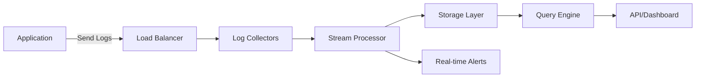

# Architecture Overview

BoxLog is built on a modern, scalable architecture designed to handle millions of logs per second while maintaining sub-second query performance.

## System Components

### 1. Ingestion Layer
- **Log Collectors**: High-performance collectors that accept logs via HTTP, gRPC, and UDP
- **Load Balancers**: Distribute incoming traffic across multiple collectors
- **Rate Limiting**: Protect the system from overload with intelligent throttling

### 2. Processing Pipeline
- **Stream Processing**: Real-time log enrichment and transformation
- **Parsing Engine**: Automatic log format detection and parsing
- **Aggregation**: Pre-compute metrics for faster queries

### 3. Storage Layer
- **Hot Storage**: Recent logs in high-performance databases
- **Warm Storage**: Compressed logs for medium-term retention
- **Cold Storage**: Long-term archival with cost-optimized storage

### 4. Query Engine
- **Distributed Search**: Parallel query execution across nodes
- **Caching Layer**: Frequently accessed data cached for speed
- **Query Optimization**: Automatic query planning and optimization

## Data Flow

## Scalability

BoxLog scales horizontally at every layer:

- **Collectors**: Add more instances to handle increased log volume
- **Processing**: Distributed stream processing with auto-scaling
- **Storage**: Automatic sharding and replication
- **Query**: Parallel query execution across multiple nodes

## Security

- **Encryption**: TLS 1.3 for data in transit, AES-256 for data at rest
- **Authentication**: API keys, OAuth 2.0, and SSO support
- **Access Control**: Fine-grained permissions and audit logging
- **Compliance**: SOC 2, GDPR, and HIPAA compliant

## Performance

- **Ingestion Rate**: Up to 1M logs/second per cluster
- **Query Latency**: < 100ms for most queries
- **Data Retention**: Configurable from 1 day to 10 years
- **Availability**: 99.9% uptime SLA

## Next Steps

- [Data Models](/docs/core-concepts/data-models) - Learn about log structure and schemas
- [Authentication](/docs/core-concepts/authentication) - Set up secure access
- [Quick Start](/docs/getting-started/quick-start) - Start sending logs